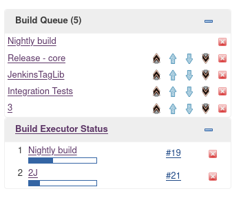

# Simple Queue Plugin
    

Plugin for Jenkins for changing a build queue order from UI or via CLI manually.

# Usage
Usage video: https://youtu.be/anyGsJIa020

There are two primary types of moves: one up/down or fast way to top/bottom. \
The third move type is added in a filtered view to distinguish between
top of *filtered* items and top of *all* items.

The user must have an Administer/Overall or MANAGE/Overall permission for
changing the queue order (required since plugin version 1.3.5).\
You need the Manage permission plugin to configure that constraint:
https://plugins.jenkins.io/manage-permission/

This plugin orders buildable items only; for that reason
[blocked](hhttps://stackoverflow.com/questions/56182285/difference-between-blocked-stuck-pending-buildable-jobs-in-jenkins)
items do NOT have an arrow.

#### Documentation site

See rendered chapters under https://jenkinsci.github.io/simple-queue-plugin

Sources of those documents are in the `docs_src` folder of this repository.

#### Screenshot

# CLI
For CLI examples and details, please see the documentation chapter at
https://jenkinsci.github.io/simple-queue-plugin/CLI/

# Other useful plugins - Alternatives
If this plugin does not fit your needs, try using some of the queue
management plugins below which use a more automated approach:

* https://plugins.jenkins.io/PrioritySorter/
* https://plugins.jenkins.io/dependency-queue-plugin/
* https://plugins.jenkins.io/multi-branch-priority-sorter/

# Question & issues
Javadoc & releases can be found on
https://repo.jenkins-ci.org/releases/io/jenkins/plugins/simple-queue/

As well as Jenkins core, our plugin uses JIRA for reporting issues:
https://issues.jenkins.io (please use the `simple-queue-plugin`
component when posting issues).

If you want to read more about this plugin, Jenkins queue
and plugin development, help yourself with this 44 pages
long document (in Czech language):
https://github.com/otradovec/baka/blob/master/bakaText.pdf

# License
This plugin is published under the terms of the MIT license.
For further information see LICENSE.txt
