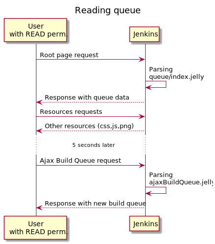
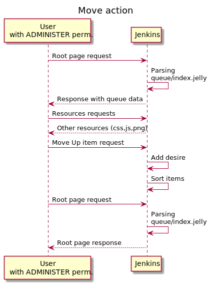
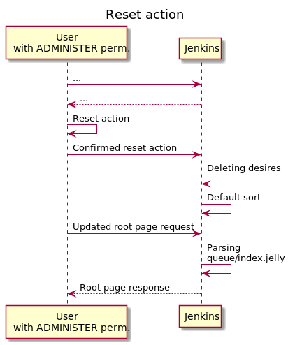

# For plugin developers
This section is intended for people who want to further extend this plugin.

## Testing build
```
mvn hpi:run
```
## Performing release
Always test connection before release.
Testing connection: ssh -T git@github.com

Release: 
```
mvn release:prepare
mvn release:perform
```
Do not forget to update docs if needed
```
cd docs_src/
mkdocs build
cd  ..
git rm -rf docs
mv  docs_src/site docs
git add docs
```
Once pushed, they will appear in https://jenkinsci.github.io automagically

Feel free to run `mvn spotless:apply` from time to time to align codestyle and formatting

## Documentation
The documentation framework used is mkdocs.
To see the documentation before publishing use 'pip install mkdocs-material' followed by 'mkdocs serve'

## How it works inside



